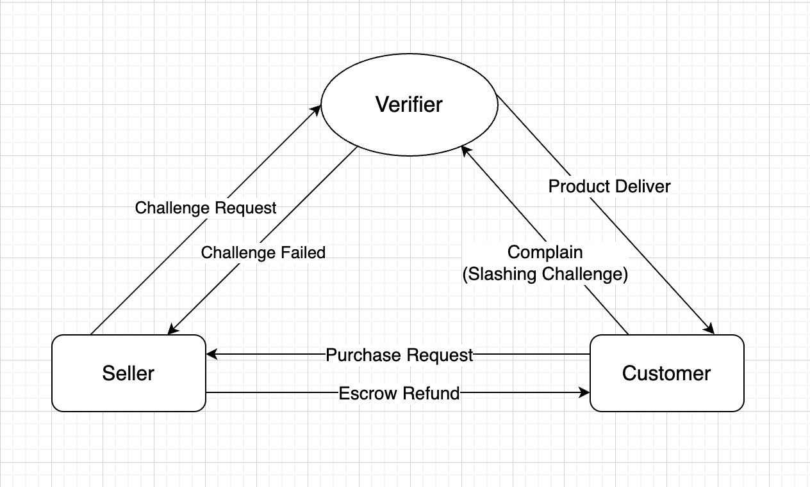

# GoReda - On-Chain Escrow Marketplace 


> Staked validator nodes physically inspect goods, and every shipping milestone is recorded on-chain. A Solana P2P commerce protocol built for the **Solana Frontier Hackathon**.

## Why GoReda?

The luxury goods market loses **$4.5 trillion annually** to counterfeits and fraud. Traditional platforms take 3-7 days for refunds, offer no verifiable shipping trail, and provide zero proof of authenticity.

**GoReda solves this in three ways:**

| Problem | GoReda |
|---|---|
| No proof of authenticity | Staked validator nodes physically inspect every item |
| Refunds take 3-7 days | **Instant refund in 1 transaction (~3 seconds)** |
| No shipping accountability | Every step recorded as an on-chain transaction with Solscan proof |
| Broken trust between strangers | SOL locked in escrow until buyer confirms delivery |

### Why Solana?

- **~400ms finality** — When a seller ships an item, the courier's backend catches the on-chain event via WebSocket and dispatches a pickup within a second. Solana is fast enough to act as a **real-time event bus** between buyer, seller, validator, and courier.
- **~$0.00025 per tx** — A full order lifecycle (up to 6 instructions) costs less than $0.002 on-chain. On Ethereum, the same flow would cost $10–50+ in gas, making per-item tracking impractical.
- **Trustless escrow via PDAs** — Buyer's SOL is locked in a Program Derived Address owned by the contract, not by GoReda. No bank, no platform, no third party can touch the funds — the code is the only rule.
- **Native WebSocket support** — Solana's `accountSubscribe` enables zero-polling real-time account change subscriptions. The buyer's shipping timeline updates automatically the moment the seller signs a transaction.

## Live Demo

- **Network:** Solana Devnet
- **Program ID:** [`ASQCCGt2VKtnMCkrTUurr7u49ZcrCMrjL4q4kFsKGCa2`](https://solscan.io/account/ASQCCGt2VKtnMCkrTUurr7u49ZcrCMrjL4q4kFsKGCa2?cluster=devnet)

## Architecture

### Three Actors

```
  BUYER                      SELLER                    VALIDATOR NODE
    |                          |                            |
    |--- Purchase (SOL locked) |                            |
    |         in escrow  ----->|                            |
    |                          |--- Ship to Validator ----->|
    |                          |                            |--- Inspect & Verify
    |                          |                            |
    |<-------------- Ship to Buyer -------------------------|
    |                          |                            |
    |--- Confirm Delivery ---->|                            |
    |    (escrow released)     |<--- Receive Payment        |
```

- **Buyer** pays product price into an on-chain escrow PDA. Can request an instant refund before the item ships.
- **Seller** confirms orders and ships to a validator node for inspection. Pays shipping + validator fee.
- **Validator Node** stakes 500+ SOL as collateral, inspects products at their physical location, then forwards to the buyer. Malicious validators get slashed.

### On-Chain State Machine

```
PURCHASED ─── REFUNDED
    │
ORDER_CONFIRMED ─── REFUNDED
    │
SHIPPED_TO_VALIDATOR
    │
SHIPPED_TO_BUYER
    │
COMPLETED (escrow released to seller)
```

Every state transition is a Solana transaction with a verifiable hash on [Solscan](https://solscan.io).

### Project Structure

```
GoReda/
├── programs/goreda/       # Anchor smart contract (Rust)
│   └── src/
│       ├── lib.rs         # Instructions & account contexts
│       ├── state.rs       # Order & Escrow data structures
│       ├── escrow.rs      # Fund, release, refund helpers
│       └── errors.rs      # Custom error codes
├── frontend/              # Next.js 16 application
│   ├── app/               # App Router pages
│   ├── components/        # Shared UI components
│   └── lib/               # Anchor client, constants, IDL
├── Anchor.toml            # Anchor workspace config
├── Cargo.toml             # Rust workspace
└── README.md
```

### Smart Contract (Anchor / Rust)

The program consists of 7 instructions with strict role-based authorization:

| Instruction | Signer | Description |
|---|---|---|
| `purchase` | Buyer | Creates Order + Escrow PDAs, locks SOL |
| `confirm_order` | Seller | Seller acknowledges the order |
| `ship_to_validator` | Seller | Records validator pubkey + tracking number |
| `ship_to_buyer` | Validator | Forwards item to buyer after inspection |
| `complete_order` | Buyer | Confirms delivery, escrow released to seller |
| `refund` | Buyer | Instant refund, closes both PDAs |
| `close_order` | Buyer | Cleanup for completed/refunded orders |

**PDA Seeds:**
- Order: `["order", buyer_pubkey, product_id_u64_le]`
- Escrow: `["escrow", order_pubkey]`

### Program Structure

```
programs/goreda/src/
├── lib.rs       # 7 instruction handlers + Accounts context structs
├── state.rs     # Order (346B) and EscrowAccount (49B) data structures
├── escrow.rs    # fund_escrow, release_escrow, refund_escrow helpers
└── errors.rs    # Custom error codes (6000-6007)
```

### Escrow Mechanics

| Operation | Method | Why |
|---|---|---|
| **Fund** | `system_program::transfer` CPI | Buyer is a signer, so standard CPI works |
| **Release** | Direct lamport manipulation | Program-owned PDAs cannot use system_program::transfer |
| **Refund** | Anchor `close = buyer` constraint | Returns ALL lamports (price + rent) in one atomic operation |

### Frontend Architecture

```
frontend/
├── app/
│   ├── page.tsx           # Landing page
│   ├── buyer/page.tsx     # Product grid + purchase flow
│   ├── orders/page.tsx    # Buyer's order list with progress tracking
│   ├── order/[id]/        # Order detail — timeline, refund, complete
│   ├── seller/page.tsx    # Seller dashboard — manage incoming orders
│   ├── verify/page.tsx    # Validator node registration
│   └── providers.tsx      # Wallet adapter + context providers
├── components/
│   ├── Navbar.tsx
│   └── ValidatorSelector.tsx
└── lib/
    ├── constants.ts       # Products, validators, status enums
    ├── program.ts         # Anchor client, PDA derivation, order fetching
    ├── ValidatorContext.tsx
    └── idl/               # Auto-generated from anchor build
```

**Real-time Updates:** WebSocket-first via `connection.onAccountChange()` with 500ms debounce. No polling. When the seller sends a transaction, the buyer's timeline updates automatically.

## Tech Stack

| Layer | Technology |
|---|---|
| Smart Contract | Anchor 0.32 (Rust) |
| Frontend | Next.js 16, React 19, TypeScript |
| Styling | Tailwind CSS 4 |
| Wallet | `@solana/wallet-adapter` (Phantom, Solflare) |
| Real-time Sync | Solana WebSocket (`accountSubscribe`) |
| Network | Solana Devnet |

## Getting Started

### Prerequisites

- [Rust](https://rustup.rs/) (1.89.0+)
- [Solana CLI](https://docs.solanalabs.com/cli/install) (1.18+)
- [Anchor CLI](https://www.anchor-lang.com/docs/installation) (0.32+)
- [Node.js](https://nodejs.org/) (18+)
- [Phantom Wallet](https://phantom.app/) browser extension

### 1. Clone the Repository

```bash
git clone https://github.com/your-username/GoReda.git
cd GoReda
```

### 2. Set Up Solana

```bash
# Configure for devnet
solana config set --url devnet

# Create a wallet (if you don't have one)
solana-keygen new

# Airdrop SOL for testing
solana airdrop 5
```

### 3. Build & Deploy the Smart Contract

```bash
# Install Rust dependencies
cargo build

# Build with Anchor
anchor build

# Deploy to devnet
anchor deploy --provider.cluster devnet

# Copy the generated IDL to frontend
cp target/idl/goreda.json frontend/lib/idl/goreda.json
cp target/types/goreda.ts frontend/lib/idl/goreda.ts
```

> The program is already deployed at `ASQCCGt2VKtnMCkrTUurr7u49ZcrCMrjL4q4kFsKGCa2` on devnet. You can skip deployment and use the existing program.

### 4. Run the Frontend

```bash
cd frontend

# Install dependencies
npm install

# Create environment file
cat > .env.local << EOF
NEXT_PUBLIC_RPC_URL=https://api.devnet.solana.com
NEXT_PUBLIC_PROGRAM_ID=ASQCCGt2VKtnMCkrTUurr7u49ZcrCMrjL4q4kFsKGCa2
NEXT_PUBLIC_SELLER_ADDRESS=<your-seller-wallet-address>
EOF

# Start dev server
npm run dev
```

Open [http://localhost:3000](http://localhost:3000) in your browser.

### 5. Demo Walkthrough

1. **Connect Phantom wallet** (set to Devnet)
2. **Browse products** at `/buyer` and purchase a wine
3. **Switch to seller wallet** and go to `/seller` to confirm the order
4. **Watch real-time tracking** update on the buyer's order page
5. **Try instant refund** before shipping — funds return in ~3 seconds
6. **Register a validator node** at `/verify` with 500+ SOL stake
